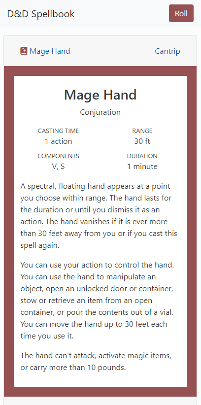
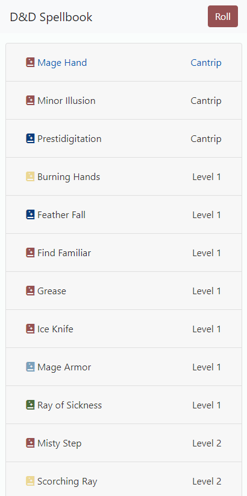
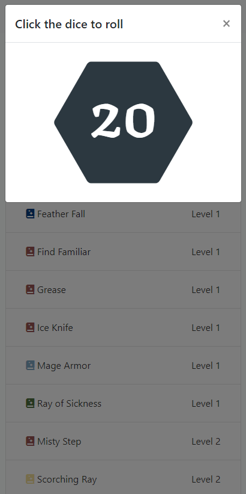

# D&D Spellbook

Check it out here: https://leaf-junkie.github.io/d20-dice-roller/

I created this little pocket spellbook to help me keep up with my spells better during D&D (Dungeons & Dragons) sessions. 

Since this is sort of a quick fix for me, the spells are just hardcoded for now. My character for this campaign is a half-elf wizard conjurer. Because I have quite a few spells from other schools of magic, I wanted to color code them based on discipline. I took inspiration from a plein air color palette, as I felt like the often softer and more natural hues complimented the mideival setting for my campaign.

## Screenshots
Below are a few screenshots of the app. The first image shows an expanded spell card. Each card contains the spell name, relevant discipline, spell level, casting time, range, components, duration, and a description.

This image displays the app with all spells collapsed and ordered by level then alphabetically, allowing the user to see their spells at a glance.

This image shows the dice roller. Shown is a 20-sided dice, which is the only one available for now. When the user clicks on the hexagon, a function runs that generates a random number between 1 and 20. This number is cleared when the user closes the modal and clicks the "Roll" button in the navigation bar. 

## Improvements
I have several improvements in mind for this project, including: 
- Make the spells data-driven using the dnd5eapi and a basic card template.
- Implement CRUD operations so that the user can search for, add, and delete spells. Editing doesn't seem that useful, but maybe some people would like the option to edit a notes section.
- Include a character sheet with important stats like level, armor class, inititative, speed, hit points, and other attributes. This would also be a good page to include an editable inventory.
- Allow the user to roll more types of die: d4, d6, d8, d10, d12.
- Allow the user to roll more than one dice at a time.
- Play around with a dice rolling animation.
- Allow user to keep track of the number of spells cast, with functionality to reset or edit this number when appropriate. 
- Although this is intended for mobile devices, it would be good to change the layout a bit for larger resolutions. The spells could be placed into a grid of three to four cards per row. The dice roller could be placed next to the card section for easier access.

## Technology
This is a simple app that uses HTML, CSS, vanilla JavaScript, and Bootstrap. The cute spellbook icon in the header of each card is a pro icon from fontawesome. To use it, you may need to create a .npmrc and follow the instructions towards the bottom here: https://fontawesome.com/how-to-use/on-the-web/setup/using-package-managers
